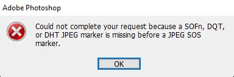
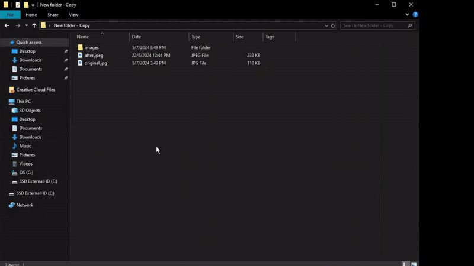

<!-- Badges -->
[](https://github.com/ItaiShek/Wazzapp/releases)

[](https://github.com/ItaiShek/Wazzapp/issues)
[](https://github.com/ItaiShek/Wazzapp/blob/main/LICENSE)


* [Description](#description)
* [Installation](#installation)
* [Usage](#usage)
* [Notes](#notes)
* [Todo](#todo)

# Description

When downloading an image from WhatsApp and opening it in Photoshop, you may encounter an error like this:



Photoshop may have trouble opening WhatsApp images directly, possibly due to how these images are saved. It seems they're often compressed and stored in a format that's best suited for viewing on mobile devices and sharing over messaging apps.

This software fixes it.


## Installation

### Windows:
[Installer](https://github.com/ItaiShek/Wazzapp/releases/latest/download/WazzappInstaller.exe) (The installer will add Wazzapp to the context menu)

[Portable](https://github.com/ItaiShek/Wazzapp/releases/latest/download/Wazzapp.exe)


## Usage
### Context menu
Right click inside/on a folder, or select multiple files.




### Console
```
Wazzapp im1.jpg [im2.jpeg ...]
or
Wazzapp directory
```

## Notes
* The only difference between the executables is that one displays the messages via messagebox, while the other does so via the console.
* The only affected files are JPEG/JPG images, other files/directories will be skipped.
* The identification of the JPEG format and conversion relies on the `stb` library. If you're facing false negatives with WhatsApp images, feel free to open an issue, and I'll look into changing it.

## Todo
[ ] Create a macOS version.